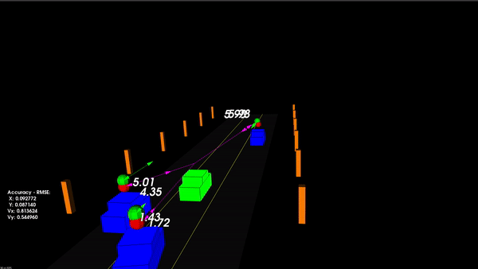

# Tracking vehicles on a highway using an Unscented Kalman Filter


## Introduction
In this project, the state of multiple cars on a highway is tracked using an Unscented Kalman Filter (UKF). The scene consists of 3 cars that are tracked and an ego vehicle which is equipped with a LiDAR and a RADAR with noisy measurements. The data obtained from these two sensors are fused to track the cars. The ego vehicle is green in colour while the other cars are blue. The ego vehicle is centered on the center lane and all the measurements are relative to it. The cars which are being tracked are accelerating and also changing their steering rates to change lanes. A constant turn rate and velocity (CTRV) model is used in the prediction step for the Unscented Kalman Filter.

In this project, tracking is done only along the X and Y axis and hence the Z measurement of the LiDAR is ignored. The red sphere on the top of the cars represent the X and Y values as per the LiDAR measurement and the purple lines represent the velocity magnitude as per the RADAR measurement. These measurements along with their measurement noise are considered in the update step of the Unscented Kalman Filter. A root mean square (RMS) analysis is performed to validate the accuracy of the tracking algorithm. The GIF above shows the tracking algorithm in action also with its accuracy which is shown in terms of the RMS values.

## Project Build Instructions
### Ubuntu
``` bash
git clone https://github.com/sumukhpatil/Unscented-Kalman-Filter.git
cd Unscented-Kalman-Filter
mkdir build && cd build
cmake ..
make
./ukf_highway
```

## Build Dependencies
* cmake >= 3.5
  * All OSes: [click here for installation instructions](https://cmake.org/install/)
* make >= 4.1 (Linux, Mac), 3.81 (Windows)
  * Linux: make is installed by default on most Linux distros
  * Mac: [install Xcode command line tools to get make](https://developer.apple.com/xcode/features/)
  * Windows: [Click here for installation instructions](http://gnuwin32.sourceforge.net/packages/make.htm)
* gcc/g++ >= 5.4
  * Linux: gcc / g++ is installed by default on most Linux distros
  * Mac: same deal as make - [install Xcode command line tools](https://developer.apple.com/xcode/features/)
  * Windows: recommend using [MinGW](http://www.mingw.org/)
 * PCL 1.2
